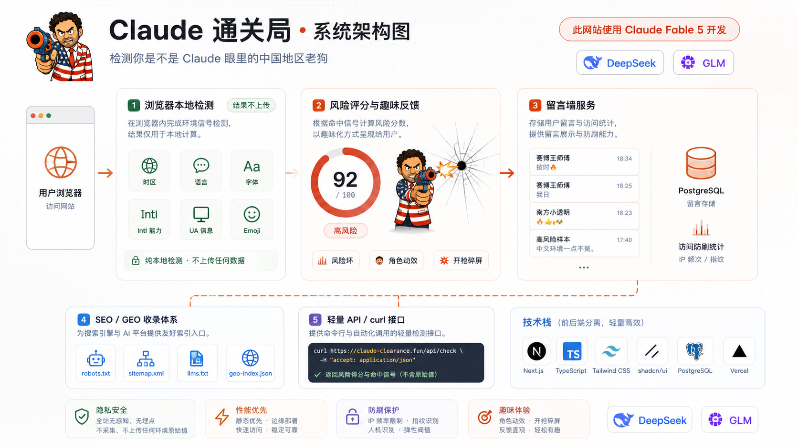
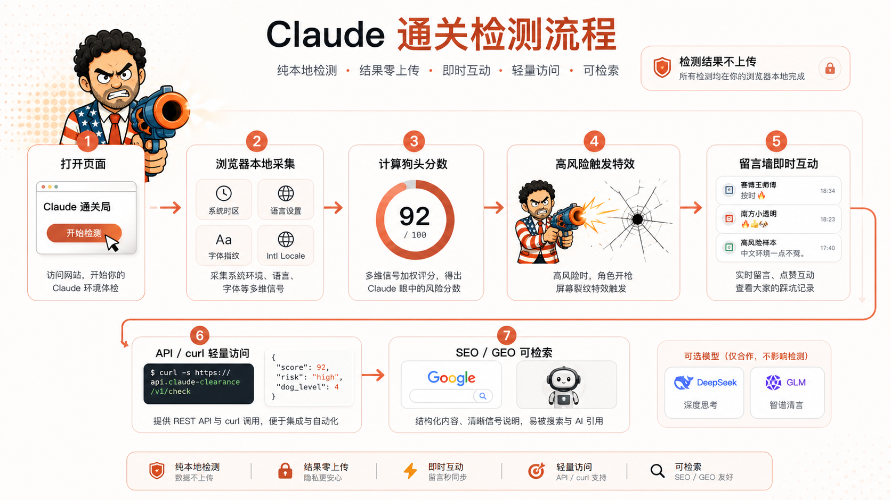
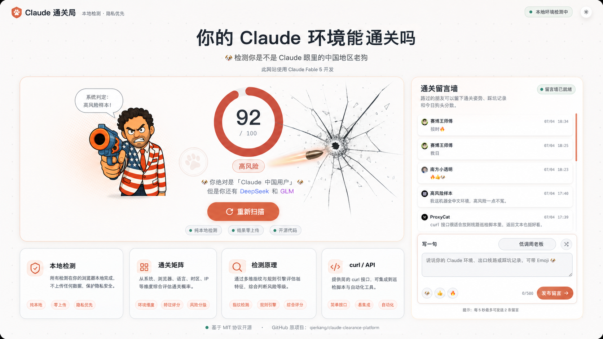

# Claude 通关局

<!-- Keywords: Claude detection, Claude Code risk check, Claude AI IP check, browser fingerprint, network exit risk, Astro TypeScript, local-first diagnostics, AI handoff, AGENTS.md, platform-project-skill -->

<div align="center">
  
</div>

<div align="center">
  <strong>本地优先的 Claude 环境与网络出口风险检测工具</strong>
  <br>
  <em>把 FuckClaude 的浏览器本地评分升级为「本地环境 · 网络出口 · 证据修复」三层通关矩阵</em>
  <br><br>
  <code>Astro</code> · <code>TypeScript</code> · <code>Vercel Function</code> · <code>AGENTS.md</code>，适合开源检测工具、AI 接手与二次产品化
  <br>
  <p>先解释风险，再给出可检查的修复方向</p>
  <br>
  <p>如果这个项目对你有用，可以给原项目和本派生思路点个 Star，让更多开发者发现它。</p>
</div>

<div align="center">

<a href="#快速开始">快速开始</a> · <a href="./docs/README_en.md">English</a> · <a href="#工作流总览">工作流</a> · <a href="#系统架构">系统架构</a> · <a href="#常见问题">FAQ</a>

</div>

<div align="center">

[](LICENSE)
[](#版本说明)
[](#项目状态)
[](https://astro.build)
[](#技术栈)
[](AGENTS.md)

</div>

---



---

## 为什么需要 Claude 通关局？

Claude 相关检测工具很容易混在一起：浏览器能读到的是本地环境，IP 检测站看到的是网络出口，Claude Code 公开逆向报告里强调的是系统时区与代理 hostname。把这些混成一个黑盒分数，会让使用者不知道自己到底该改系统设置、浏览器语言，还是网络线路。

- 原 FuckClaude 侧重浏览器本地信号，隐私边界清晰，但网络出口维度较弱。
- Claude AI IP 检测类工具侧重出口 IP、ASN、WebRTC、DNS、分流一致性，但浏览器本地环境解释不足。
- 很多检测结论只给“高/中/低风险”，缺少来源、可信度、贡献分和修复建议。
- 开源项目被二次接手时，常缺 `AGENTS.md`、graphify、升级报告和可复用资产目录。
- README 如果不是默认中文、图片不是双语，后续对国内团队和英文开源发布都不友好。

**Claude 通关局把这些检查拆成可解释、可扩展、可交接的工程流程。**

```bash
pnpm install
pnpm dev
```

| 能力 | 交付结果 |
|---|---|
| 本地浏览器检测 | 时区、语言、字体、Intl、UA 风格在浏览器内完成 |
| 网络出口规划 | IP、ASN、WebRTC、DNS 作为独立网络检查层，不伪装成本地检测 |
| 风险解释 | 每个命中项都能追溯来源、权重、可信度和修复方向 |
| AI 接手层 | `AGENTS.md`、`CLAUDE.md`、`START-HERE.md`、graphify、升级报告齐全 |
| 双语资产 | 中文 README 引用 `zh-CN` 图片，英文 README 引用 `en` 图片 |

## 项目概述

`Claude 通关局` 是从上游开源项目 `LinXiaoTao/FuckClaude` 派生并升级的 Claude 环境风险检测平台。它保留原项目“浏览器本地检测、不上传扫描结果”的核心逻辑，同时参考 `ipinfo.cv/claude-ai-check` 这类 Claude AI IP 检测工具的公开检查维度，把出口 IP、ASN、WebRTC、DNS、分流一致性独立为网络出口层，最终形成面向开发者、代理线路使用者和 AI 工程团队的通关矩阵。

> **English summary**: Claude Clearance is a local-first Claude environment and network-exit risk checker forked from FuckClaude. It preserves the browser-only scoring baseline and adds a productized clearance matrix for local signals, network exit checks, evidence, and fix guidance.
>
> If this saves you time, a Star helps others find it.

## 核心特色

- **本地优先检测**：系统时区、浏览器语言、中文字体、Intl Locale、时区偏移和 UA/Emoji 风格在浏览器端计算，默认不上传扫描结果。
- **网络出口分层**：出口 IP、国家、ASN、WebRTC 泄漏、DNS 泄漏和多区域分流只作为网络侧检查层规划，避免混淆本地信号和服务端可见信号。
- **证据化评分**：沿用原项目 100 分权重模型，后续扩展时每项信号都必须说明来源、可信度、贡献分和修复建议。
- **双语视觉资产**：中文根 README 使用 `zh-CN` 资产，英文 README 使用 `en` 资产，顶部介绍图、架构图、UI 图、流程图均已生成。
- **AI 接手友好**：通过 `platform-project-skill` 补齐接手文件、升级报告、graphify 图谱和资产 manifest，方便后续 Claude / Codex / Cursor 继续开发。

## 与同类方案对比

| 方案 | 本地浏览器信号 | 网络出口维度 | 证据解释 | 双语 README/图片 | AI 接手层 |
|---|:---:|:---:|:---:|:---:|:---:|
| **Claude 通关局** | 是 | 规划为独立层 | 是 | 是 | 是 |
| FuckClaude 原项目 | 是 | 有服务端估算但较轻 | 部分 | 中英同页 | 否 |
| Claude AI IP 检测站 | 部分 | 是 | 取决于站点 | 不确定 | 否 |
| 手工排查时区/代理 | 分散 | 分散 | 否 | 否 | 否 |

## 工作流总览

| 阶段 | 输入 | 输出 |
|---|---|---|
| 本地扫描 | 浏览器可见环境 | 6 项本地信号、贡献分、风险等级 |
| 服务端估算 | 请求头与部署平台 geo header | IP 时区、国家、语言、UA 的 70/100 归一化估算 |
| 网络出口深检 | 出口 IP、ASN、WebRTC、DNS | 后续 opt-in 检测项与线路一致性证据 |
| 证据解释 | 命中信号与权重 | 来源、可信度、贡献分、修复建议 |
| AI 接手 | 项目源码与文档 | README、AGENTS、CLAUDE、graphify、升级报告 |

不确定某项检查应放在哪一层时，默认先判断“它是否需要访问服务端或第三方 IP API”；需要外部可见性的，不能标成纯本地检测。

## 快速开始

### 前置条件

- Node.js 与 pnpm
- Docker（用于项目独立 PostgreSQL，默认映射到 `127.0.0.1:55432`）
- 需要本地运行 Astro 项目
- 可选：Vercel 部署环境，用于 `/api/check` 读取 geo header

### 本地启动

```bash
pnpm install
pnpm db:setup
pnpm dev
```

访问：

```text
http://localhost:4321
http://localhost:4321/zh/
```

### 构建验证

```bash
pnpm build
```

<details>
<summary>核心目录结构</summary>

```text
claude-clearance-platform/
├── README.md
├── docs/README_en.md
├── AGENTS.md
├── CLAUDE.md
├── START-HERE.md
├── assets/
│   ├── social-preview.png
│   ├── social-preview-en.png
│   └── platform/
│       ├── architecture/{zh-CN,en}/
│       ├── design/{zh-CN,en}/
│       └── flow/{zh-CN,en}/
├── src/
│   ├── config/signals.ts
│   ├── scripts/detect.ts
│   ├── pages/api/check.ts
│   └── components/Detector.astro
└── graphify-out/GRAPH_REPORT.md
```

</details>



## 功能模块

### 本地浏览器检测

- `src/config/signals.ts` 定义 6 项本地信号与权重。
- 系统时区是最接近公开逆向描述的 Claude Code 相关信号。
- 中文字体通过 Canvas 宽度探测，属于浏览器指纹估算。
- `src/scripts/detect.ts` 负责扫描动画、累计分数、风险分档与分享结果。

### curl/API 服务端估算

- `src/pages/api/check.ts` 暴露 `/api/check`。
- 读取 `x-vercel-ip-timezone`、`x-vercel-ip-country`、`Accept-Language`、`User-Agent`。
- 由于字体和 Intl Locale 只能浏览器读取，API 按可见权重归一化。
- 本地或非 Vercel 部署时 geo header 缺失，会自然降级。

### 通关矩阵 UI

- `src/components/Detector.astro` 展示本地检测列表与通关矩阵。
- 三层矩阵为：本地环境、网络出口、证据与修复。
- 当前网络出口项是产品化设计维度，真实检测需要后续显式 opt-in。

### AI 接手与资产体系

- `AGENTS.md` 与 `CLAUDE.md` 说明边界：不重命名业务目录、不替换构建系统、不全仓格式化。
- `docs/ai-upgrade/report-老项目AI能力升级.md` 记录扫描范围、改动、风险与建议。
- `assets/asset-manifest.json` 登记所有 README 展示图。
- `graphify-out/GRAPH_REPORT.md` 提供代码结构图谱。

## 技术栈

| 层级 | 技术或资产 | 说明 |
|---|---|---|
| 前端框架 | Astro 7 | 静态页面 + Vercel Function |
| 语言 | TypeScript | 检测逻辑、API 估算、分享卡片 |
| 部署适配 | `@astrojs/vercel` | `/api/check` 作为按需函数 |
| 本地检测 | Browser APIs | `Intl`、`navigator`、Canvas、UA |
| 图谱 | graphify | 生成 `graphify-out/GRAPH_REPORT.md` |
| 图片资产 | image_gen | 顶部图、架构图、UI 图、流程图 |
| 项目升级 | platform-project-skill | 非侵入式补齐 AI 接手层 |
| README gate | `readme-gate.py` | 校验中文 README 和英文 README 结构 |

## 系统架构

### 工作流设计

```text
用户打开页面
    ↓
浏览器本地检测
    ├─ 系统时区
    ├─ 浏览器语言
    ├─ 中文字体
    ├─ Intl Locale
    ├─ 时区偏移
    └─ UA / Emoji 风格
    ↓
风险评分引擎
    ├─ 0..1 相似度
    ├─ 权重贡献分
    └─ low / medium / high 分档
    ↓
通关矩阵输出
    ├─ 本地环境
    ├─ 网络出口
    └─ 证据与修复
```

### 架构说明

浏览器本地信号和服务端可见信号必须分开：本地信号可以在页面内完成，网络出口信号需要服务端或第三方服务可见性。当前项目已实现本地检测和 API 估算，网络出口深检作为后续 opt-in 扩展。



## 目录结构

```text
src/config/signals.ts          信号定义、权重、纯评分函数
src/scripts/detect.ts          客户端扫描流程、分数累计、分享逻辑
src/pages/api/check.ts         curl/API 服务端估算
src/components/Detector.astro  页面主体与通关矩阵
src/i18n/ui.ts                 中英文文案
assets/platform/               双语 README 图片资产
docs/documents/                检测逻辑分析文档
docs/ai-upgrade/               老项目 AI 能力升级报告
graphify-out/                  代码图谱报告
```

## 命令参考

| 命令 | 作用 |
|---|---|
| `pnpm install` | 安装依赖 |
| `pnpm db:setup` | 启动项目独立 PostgreSQL，执行迁移并灌入随机留言 |
| `pnpm db:migrate` | 只执行 PostgreSQL schema 迁移 |
| `pnpm db:seed` | 灌入 10-50 条随机演示留言，默认 32 条 |
| `pnpm dev` | 启动本地开发服务 |
| `pnpm build` | 构建 Astro/Vercel 产物 |
| `curl http://localhost:4321/api/check` | 文本形式服务端估算 |
| `curl "http://localhost:4321/api/check?format=json"` | JSON 形式服务端估算 |
| `curl "http://localhost:4321/api/messages?limit=10"` | 读取 PostgreSQL 留言 |
| `curl -X POST http://localhost:4321/api/stats/visit` | 写入一次防刷访问统计 |
| `platform-project-skill/scripts/verify-assets.sh .` | 校验资产 manifest |
| `platform-project-skill/scripts/check-project-baseline.sh --existing .` | 校验老项目升级基线 |

## 开发指南

### 修改检测权重

优先修改 `src/config/signals.ts`，保证权重合计和 `riskBand()` 分档逻辑一致。新增信号时，要同步 UI 文案、API 可见性说明和 README。

### 增加网络出口检测

网络出口检测必须显式 opt-in，并说明会访问服务端或第三方 API。不要把 WebRTC、DNS、ASN 结果伪装成本地纯浏览器结果。

### 修改 README 图片

中文图片放在 `assets/.../zh-CN/`，英文图片放在 `assets/.../en/`。新增图片后必须登记 `assets/asset-manifest.json`。

### 安全边界

保留原项目 MIT 署名与上游链接；不要删除原作者授权信息。不要把真实密钥、代理地址、内网地址写入 README 或示例。

## 开发与验证

按顺序执行：

```bash
pnpm build
platform-project-skill/scripts/verify-assets.sh .
platform-project-skill/scripts/check-project-baseline.sh --existing .
~/.claude/scripts/readme-gate.py --readme README.md
~/.claude/scripts/readme-gate.py --readme docs/README_en.md
```

通过标准：

- 构建命令退出码为 0。
- `verify-assets.sh` 输出 `STATE=asset_done`。
- `check-project-baseline.sh --existing` 输出 `STATE=validation_done`。
- 两份 README gate 均 `pass=true`。
- README 展示图片路径存在且未放入 fenced code block。

## 项目状态

| 项 | 状态 |
|---|---|
| 项目阶段 | `0.1.0` 派生升级版 |
| scaffold | 已通过 `platform-project-skill` 非侵入升级 |
| assets | `STATE=asset_done` |
| validation | `STATE=validation_done` |
| graphify | 已生成 `72 nodes / 126 edges / 13 communities` |
| local database | PostgreSQL Docker baseline 已接入，`pnpm db:setup` 可初始化 |
| SEO/GEO | 已补 `llms.txt`、`geo-index.json`、sitemap、JSON-LD、FAQ |
| 已知风险 | WebRTC/DNS/ASN 深检尚未接入运行时 |

## 常见问题

<details>
<summary>这个项目等同于 Claude 官方检测吗？</summary>

不是。它基于公开逆向报告和浏览器/IP 可见信号做风险估算，不代表 Claude 官方判定。

</details>

<details>
<summary>哪些信号是真正本地检测？</summary>

系统时区、浏览器语言、中文字体、Intl Locale、时区偏移、UA/Emoji 风格属于浏览器本地可见信号。

</details>

<details>
<summary>为什么网络出口检测没有直接算进当前分数？</summary>

出口 IP、ASN、WebRTC、DNS 需要服务端或第三方可见性。为避免误导，当前 README 和 UI 把它们作为独立网络检查层。

</details>

<details>
<summary>如何查看代码结构？</summary>

先读 `graphify-out/GRAPH_REPORT.md`，再定位 `src/config/signals.ts`、`src/scripts/detect.ts`、`src/pages/api/check.ts`。

</details>

## 参与贡献

- Bug 或检测误判：请附浏览器、系统时区、语言列表、运行方式和预期结果。
- 新增检测项：先说明本地可见还是服务端可见，再给出隐私边界。
- README 或图片修改：同步中文与英文版本，并登记 manifest。
- English contributors can start from [`docs/README_en.md`](./docs/README_en.md).

## 版本说明

| 版本 | 日期 | 说明 |
|---|---|---|
| `0.1.0` | 2026-07-04 | 从 FuckClaude 派生，补齐 Claude 通关局品牌、通关矩阵 UI、AI 接手层、双语图片资产与 README 母版结构 |

更多变更见 [CHANGELOG.md](./CHANGELOG.md)。

## 致谢

- `LinXiaoTao/FuckClaude`：原始浏览器本地检测工具与评分逻辑来源。
- [Astro](https://astro.build)：静态站点与 Vercel Function 构建能力。
- `platform-project-skill`：项目接手层、README 规则和资产校验流程。

## Star History · Star 历史

<a href="https://star-history.com/#qierkang/claude-clearance-platform&Date">
  <picture>
    <source media="(prefers-color-scheme: dark)" srcset="https://api.star-history.com/svg?repos=qierkang/claude-clearance-platform&type=Date&theme=dark" />
    <source media="(prefers-color-scheme: light)" srcset="https://api.star-history.com/svg?repos=qierkang/claude-clearance-platform&type=Date" />
    
  </picture>
</a>

## 许可证

本项目继承上游 MIT License。二次发布或再分发时必须保留上游项目 `LinXiaoTao/FuckClaude` 的版权与许可证声明。

## 作者

- 升级与项目接手：`xyqierkang@gmail.com`
- GitHub：<https://github.com/qierkang>
- 上游作者：[`LinXiaoTao`](https://github.com/LinXiaoTao)
