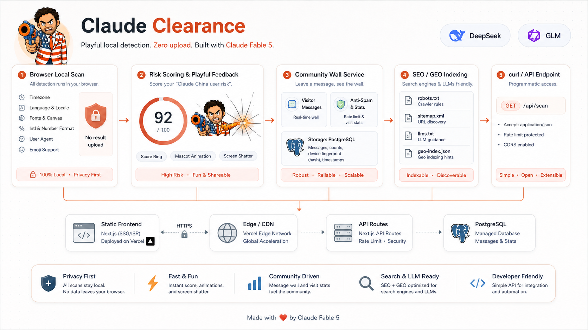
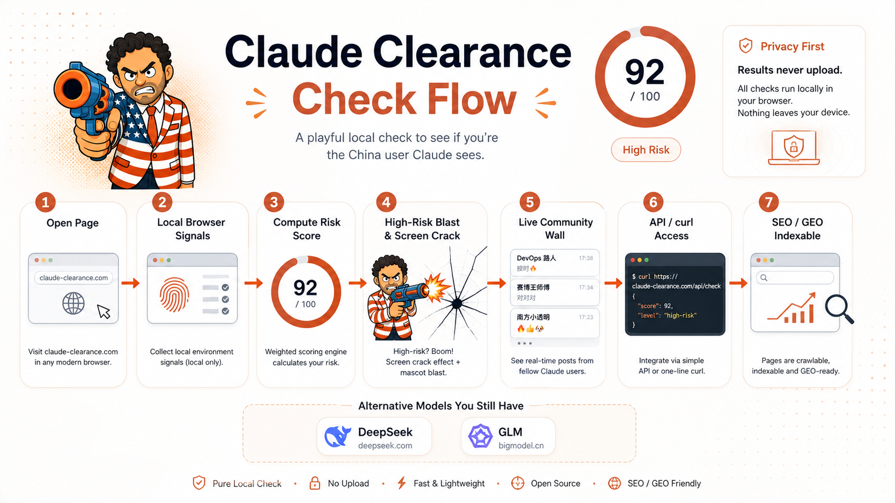
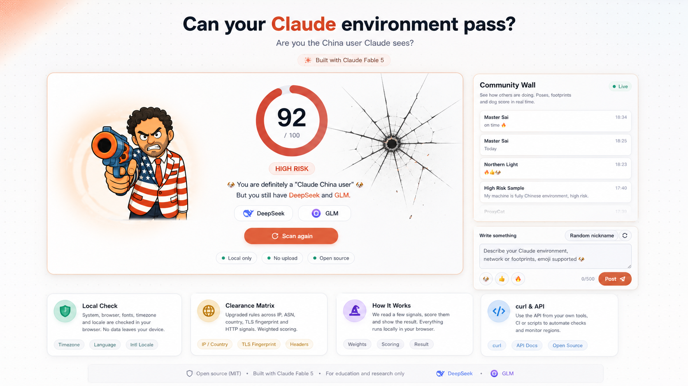

# Claude Clearance

<!-- Keywords: Claude detection, Claude Code risk check, Claude AI IP check, browser fingerprint, network exit risk, Astro TypeScript, local-first diagnostics, AI handoff, AGENTS.md, platform-project-skill -->

<div align="center">
  
</div>

<div align="center">
  <strong>Playful local-first Claude environment checker with a community wall and SEO/GEO indexing.</strong>
  <br>
  <em>An upgraded FuckClaude fork that separates local browser signals, server-side estimates, evidence, and product handoff assets.</em>
  <br><br>
  <code>Astro</code> · <code>TypeScript</code> · <code>Vercel Function</code> · <code>PostgreSQL</code> · <code>AGENTS.md</code>
  <br>
  <p>Explain risk first, then show what to inspect.</p>
  <br>
  <p>If this project is useful, a Star helps other developers find it.</p>
</div>

<div align="center">

<a href="#quick-start">Quick Start</a> · <a href="../README.md">Chinese README</a> · <a href="#workflow-overview">Workflow</a> · <a href="#architecture">Architecture</a> · <a href="#faq">FAQ</a>

</div>

<div align="center">

[](../LICENSE)
[](#version-notes)
[](#project-status)
[](https://astro.build)
[](#tech-stack)
[](../AGENTS.md)

</div>

---



---

## Why This Exists

Claude-related diagnostic tools often mix three different layers: what the browser can see locally, what an IP check service can see from the network, and what public reverse-engineering reports describe for Claude Code. When these are collapsed into one opaque score, users cannot tell whether they should review OS settings, browser language, proxy routes, DNS, or ASN exposure.

- FuckClaude is strong at local browser signals and privacy boundaries, but its network-exit layer is lighter.
- Claude AI IP check tools focus on exit IP, ASN, WebRTC, DNS, and route consistency, but local browser evidence is usually less explicit.
- Many tools only show low, medium, or high risk without source, confidence, contribution, or fix direction.
- Forked projects are hard for AI agents to continue without `AGENTS.md`, graph reports, upgrade notes, and reusable assets.
- English and Chinese README/image parity matters for both public open-source release and local team handoff.

**Claude Clearance turns these checks into an explainable and AI-handoff-friendly workflow.**

## Overview

`Claude Clearance` is an upgraded fork of the upstream open-source project `LinXiaoTao/FuckClaude`. It preserves the original browser-local scoring baseline and adds a productized clearance matrix inspired by Claude AI IP check tools such as `ipinfo.cv/claude-ai-check`: local environment, network exit, risk score, evidence, and fix guidance.

If this saves you time, a Star helps others find it.

## Features

- **Local-first scan**: OS timezone, browser language, Chinese fonts, Intl locale, timezone offset, and UA/emoji style are computed in the browser.
- **Separated network layer**: Exit IP, country, ASN, WebRTC leak, DNS leak, and split-route consistency are treated as network checks, not browser-only signals.
- **Evidence-based scoring**: The project keeps the 100-point weighted model and requires source, confidence, contribution, and fix guidance for future signals.
- **Community wall**: Visitors can post notes, route experiences, and playful score reports backed by PostgreSQL.
- **AI-agent ready**: `platform-project-skill` added handoff files, upgrade report, graphify output, and asset manifest.

## Comparison

| Option | Local browser signals | Network exit layer | Evidence explanation | Bilingual README/images | AI handoff |
|---|:---:|:---:|:---:|:---:|:---:|
| **Claude Clearance** | Yes | Planned as a separate layer | Yes | Yes | Yes |
| Original FuckClaude | Yes | Light server estimate | Partial | Mixed in one README | No |
| Claude AI IP check sites | Partial | Yes | Site-dependent | Unknown | No |
| Manual timezone/proxy checks | Scattered | Scattered | No | No | No |

## Workflow Overview

| Stage | Input | Output |
|---|---|---|
| Local scan | Browser-visible environment | Six local signals, contributions, risk band |
| Server estimate | Request headers and deployment geo headers | Normalized 70/100 IP/header estimate |
| Network deep checks | Exit IP, ASN, WebRTC, DNS | Future opt-in evidence for route consistency |
| Evidence explanation | Hits and weights | Source, confidence, contribution, fix guidance |
| AI handoff | Source code and docs | README, AGENTS, CLAUDE, graphify, upgrade report |

When unsure where a check belongs, ask whether it needs server-side or third-party visibility. If it does, it must not be labelled as local-only.

## Quick Start

### Prerequisites

- Node.js and pnpm
- Docker for the project-local PostgreSQL service, mapped to `127.0.0.1:55432`
- Local Astro development environment
- Optional Vercel deployment for `/api/check` geo headers

### Run Locally

```bash
pnpm install
pnpm db:setup
pnpm dev
```

Open:

```text
http://localhost:4321
http://localhost:4321/zh/
```

### Build

```bash
pnpm build
```

<details>
<summary>Core structure</summary>

```text
claude-clearance-platform/
├── README.md
├── docs/README_en.md
├── AGENTS.md
├── CLAUDE.md
├── START-HERE.md
├── assets/
│   ├── social-preview.png
│   ├── social-preview-en.png
│   └── platform/
│       ├── architecture/{zh-CN,en}/
│       ├── design/{zh-CN,en}/
│       └── flow/{zh-CN,en}/
├── src/
│   ├── config/signals.ts
│   ├── scripts/detect.ts
│   ├── pages/api/check.ts
│   └── components/Detector.astro
└── graphify-out/GRAPH_REPORT.md
```

</details>



## Modules

### Local Browser Scan

- `src/config/signals.ts` defines the six local signals and weights.
- OS timezone is the signal closest to the public Claude Code reverse-engineering reports.
- Chinese fonts are estimated through Canvas width probing.
- `src/scripts/detect.ts` handles scan animation, score accumulation, and risk bands.

### API Server Estimate

- `src/pages/api/check.ts` exposes `/api/check`.
- It reads `x-vercel-ip-timezone`, `x-vercel-ip-country`, `Accept-Language`, and `User-Agent`.
- Because fonts and Intl locale are browser-only, API scoring is normalized over visible weight.
- Local and non-Vercel deployments naturally degrade when geo headers are absent.

### Community Wall

- `src/components/CommunityBoard.astro` renders the live message wall and composer.
- `src/pages/api/messages.ts` reads and writes visitor messages.
- `src/pages/api/stats/visit.ts` records anti-refresh visit counts.
- `src/lib/server/community.ts` contains rate limiting, nickname defaults, and message persistence.

### AI Handoff and Assets

- `AGENTS.md` and `CLAUDE.md` define safe editing boundaries.
- The upgrade report records scope, changes, risks, and recommendations.
- `assets/asset-manifest.json` registers README images.
- `graphify-out/GRAPH_REPORT.md` documents code structure.

## Tech Stack

| Layer | Technology or asset | Notes |
|---|---|---|
| Frontend | Astro 7 | Static pages plus Vercel Function |
| Language | TypeScript | Detection logic, API estimate, and UI scripts |
| Deployment adapter | `@astrojs/vercel` | `/api/check` as on-demand function |
| Local scan | Browser APIs | `Intl`, `navigator`, Canvas, UA |
| Database | PostgreSQL | Community wall messages and visit stats |
| Graph | graphify | Generates `graphify-out/GRAPH_REPORT.md` |
| Visual assets | image_gen | Social preview, architecture, UI, flow |
| Upgrade workflow | platform-project-skill | Non-invasive AI handoff upgrade |
| README gate | `readme-gate.py` | Validates README structure |

## Architecture

### Workflow Design

```text
User opens page
    ↓
Browser local scan
    ├─ OS timezone
    ├─ Browser language
    ├─ Chinese fonts
    ├─ Intl locale
    ├─ Timezone offset
    └─ UA / Emoji style
    ↓
Risk scoring engine
    ├─ 0..1 similarity
    ├─ Weighted contribution
    └─ low / medium / high band
    ↓
Clearance matrix output
    ├─ Local environment
    ├─ Network exit
    └─ Evidence and fixes
```

### Notes

Browser-local and server-visible signals must stay separate. Local signals can be checked inside the page; network-exit signals require server-side or third-party visibility. The current project implements local scan and API estimate, while deeper network checks remain future opt-in extensions.



## Directory

```text
src/config/signals.ts          signal definitions, weights, pure scoring functions
src/scripts/detect.ts          client scan flow and score accumulation
src/pages/api/check.ts         curl/API server estimate
src/components/Detector.astro  main UI and clearance matrix
src/components/CommunityBoard.astro  community wall UI
src/i18n/ui.ts                 English and Chinese copy
assets/platform/               bilingual README image assets
docs/documents/                detection logic analysis
docs/ai-upgrade/               AI upgrade report
graphify-out/                  code graph report
```

## Commands

| Command | Purpose |
|---|---|
| `pnpm install` | Install dependencies |
| `pnpm db:setup` | Start project-local PostgreSQL, run migrations, and seed demo messages |
| `pnpm db:migrate` | Run PostgreSQL schema migration only |
| `pnpm db:seed` | Seed 10-50 random demo messages, default 32 |
| `pnpm dev` | Start local dev server |
| `pnpm build` | Build Astro/Vercel output |
| `curl http://localhost:4321/api/check` | Text server-side estimate |
| `curl "http://localhost:4321/api/check?format=json"` | JSON server-side estimate |
| `curl "http://localhost:4321/api/messages?limit=10"` | Read PostgreSQL-backed messages |
| `curl -X POST http://localhost:4321/api/stats/visit` | Record one anti-refresh counted visit |

## Development Guide

### Change Detection Weights

Modify `src/config/signals.ts` first. Keep total weight and `riskBand()` behavior coherent. New signals require UI copy, API visibility notes, and README updates.

### Add Network-Exit Checks

Network checks must be explicit opt-in and must disclose server-side or third-party API usage. Do not present WebRTC, DNS, or ASN results as local-only browser checks.

### Update README Images

Chinese images live under `assets/.../zh-CN/`; English images live under `assets/.../en/`. Register every new image in `assets/asset-manifest.json`.

### Safety Boundaries

Keep the upstream MIT attribution and links. Do not write real secrets, proxy endpoints, internal IPs, or private routes into README examples.

## Validation

Run:

```bash
pnpm build
platform-project-skill/scripts/verify-assets.sh .
platform-project-skill/scripts/check-project-baseline.sh --existing .
~/.claude/scripts/readme-gate.py --readme README.md
~/.claude/scripts/readme-gate.py --readme docs/README_en.md
```

Pass criteria:

- Build exits with code 0.
- `verify-assets.sh` prints `STATE=asset_done`.
- `check-project-baseline.sh --existing` prints `STATE=validation_done`.
- Both README gates return `pass=true`.
- README image paths exist and are not wrapped in fenced code blocks.

## Project Status

| Item | Status |
|---|---|
| Project stage | `0.1.0` upgraded fork |
| scaffold | Non-invasive upgrade via `platform-project-skill` |
| assets | `STATE=asset_done` |
| validation | `STATE=validation_done` |
| graphify | `72 nodes / 126 edges / 13 communities` |
| local database | PostgreSQL Docker baseline is wired; `pnpm db:setup` initializes it |
| SEO/GEO | `llms.txt`, `geo-index.json`, sitemap, JSON-LD, and FAQ are present |
| known risk | WebRTC/DNS/ASN deep checks are not wired at runtime yet |

## FAQ

<details>
<summary>Is this an official Claude check?</summary>

No. It is a risk estimate based on public reverse-engineering reports and browser/IP-visible signals.

</details>

<details>
<summary>Which checks are truly local?</summary>

OS timezone, browser language, Chinese fonts, Intl locale, timezone offset, and UA/emoji style are browser-local signals.

</details>

<details>
<summary>Why are network-exit checks not included in the current score?</summary>

Exit IP, ASN, WebRTC, and DNS require server-side or third-party visibility. They are separated to avoid misleading local-only claims.

</details>

<details>
<summary>How should an AI agent inspect this project?</summary>

Read `graphify-out/GRAPH_REPORT.md`, then inspect `src/config/signals.ts`, `src/scripts/detect.ts`, and `src/pages/api/check.ts`.

</details>

## Contributing

- For bugs or false positives, include browser, OS timezone, language list, run mode, and expected result.
- For new signals, state whether they are browser-local or server-visible.
- For README or image changes, update both Chinese and English docs and register assets.
- Chinese contributors can start from [`README.md`](../README.md).

## Version Notes

| Version | Date | Notes |
|---|---|---|
| `0.1.0` | 2026-07-04 | Forked from FuckClaude; added Claude Clearance branding, clearance matrix UI, AI handoff layer, bilingual image assets, and template-style README structure |

See [CHANGELOG.md](../CHANGELOG.md) for future updates.

## Acknowledgements

- `LinXiaoTao/FuckClaude`: upstream browser-local detection and scoring baseline.
- [Astro](https://astro.build): static site and Vercel Function build support.
- `platform-project-skill`: AI handoff workflow, README rules, and asset validation.

## Star History

<a href="https://star-history.com/#qierkang/claude-clearance-platform&Date">
  <picture>
    <source media="(prefers-color-scheme: dark)" srcset="https://api.star-history.com/svg?repos=qierkang/claude-clearance-platform&type=Date&theme=dark" />
    <source media="(prefers-color-scheme: light)" srcset="https://api.star-history.com/svg?repos=qierkang/claude-clearance-platform&type=Date" />
    
  </picture>
</a>

## License

This project inherits the upstream MIT License. Redistributions must preserve the copyright and license notice of the upstream project `LinXiaoTao/FuckClaude`.

## Author

- Upgrade and handoff: `xyqierkang@gmail.com`
- GitHub: <https://github.com/qierkang>
- Upstream author: [`LinXiaoTao`](https://github.com/LinXiaoTao)
